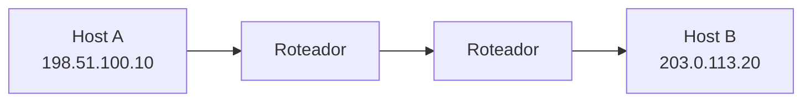

# Por que existe NAT?

O endereço `192.168.1.10` pode existir ao mesmo tempo na casa de Murilo, na casa de Anderson e em milhões de outras redes. Essa repetição não é um acidente. Ela é parte da solução que permitiu conectar mais aparelhos do que o IPv4 consegue identificar diretamente.

Para entender por que o NAT existe, é preciso separar duas histórias. A internet sempre precisou de equipamentos para encaminhar pacotes entre redes. O que mudou foi a expectativa de que cada computador teria um endereço público próprio.

Para escrever este artigo, precisei pesquisar um pouco da história da internet e organizar o que encontrei. Minha intenção é tentar passar essa informação de forma simples, sem esconder as partes que precisei aprender pelo caminho.

## Roteadores vieram antes do NAT

A ARPANET, uma das redes que deram origem à internet, já usava equipamentos intermediários para encaminhar pacotes. Quando o IPv4 foi documentado em 1981, eles eram chamados de *gateways*. Hoje usamos o nome roteadores.

Um roteador recebe um pacote, observa o endereço de destino e escolhe o próximo caminho. No desenho original da internet, ele normalmente não alterava o endereço de origem nem o de destino. Cada computador conectado tinha um endereço público, e os roteadores apenas faziam o pacote avançar.

Se o host A oferecesse um serviço na porta `5000`, o host B poderia enviar um pacote para `198.51.100.10:5000`. Os roteadores no caminho não precisavam guardar uma sessão dessa conversa. Cada um respondia apenas a uma pergunta: para onde devo encaminhar este endereço agora?

Esse modelo favorecia a comunicação direta entre as pontas. Também dependia de uma condição difícil de sustentar: haver um endereço público para cada máquina.

## O limite cabe em 32 bits

Um endereço IPv4 possui 32 bits, o que permite cerca de 4,29 bilhões de combinações. Nem todas ficam disponíveis para computadores comuns, pois existem blocos reservados para usos especiais. Ainda assim, nos primeiros anos, alguns bilhões pareciam uma quantidade confortável.

A escala mudou. A internet deixou de conectar apenas universidades, centros de pesquisa e empresas. Passou a incluir computadores pessoais, servidores, celulares, consoles, câmeras, televisores e muitos outros aparelhos. Ao mesmo tempo, a distribuição inicial dos blocos não foi feita com a eficiência que a escassez futura exigiria.

Criar um espaço de endereços maior seria a solução estrutural, e o IPv6 faz isso. Mas substituir um protocolo usado por toda a internet demanda mudanças em sistemas operacionais, roteadores, aplicações e redes de provedores. Era necessário ganhar tempo sem exigir uma migração simultânea de todos.

## Endereços privados podem se repetir

Em 1996, a RFC 1918 reservou três blocos para redes privadas:

| Bloco | Intervalo |
|---|---|
| `10.0.0.0/8` | `10.0.0.0` a `10.255.255.255` |
| `172.16.0.0/12` | `172.16.0.0` a `172.31.255.255` |
| `192.168.0.0/16` | `192.168.0.0` a `192.168.255.255` |

Esses endereços não devem ser anunciados na internet pública. Dentro de uma casa, `192.168.1.10` identifica um aparelho. Fora dela, não aponta para uma residência específica. Por isso, redes diferentes podem reutilizar o mesmo bloco sem entrar em conflito.

O Network Address Translation, ou NAT, conecta esses dois mundos. Os aparelhos usam endereços privados na rede local, enquanto o tráfego que sai é representado por um endereço público. Uma casa inteira pode, assim, consumir apenas um endereço IPv4 público.

Eu e [@ocordeiro](https://github.com/ocordeiro) discutimos muito sobre isso até uma ideia finalmente fazer sentido: uma forma útil de enxergar o NAT é como um pequeno banco de dados dentro do roteador. Quando um aparelho inicia uma comunicação, o NAT registra uma associação entre o endereço e a porta usados dentro da rede e aqueles usados do lado de fora. Quando a resposta chega, ele consulta esse registro para descobrir a qual aparelho deve entregá-la. A analogia não descreve tudo, porque o NAT também altera os pacotes e segue regras próprias, mas essa tabela ajuda a entender como um único endereço público pode representar vários aparelhos.

O NAT foi proposto em 1994 como uma solução de curto prazo para conservar endereços. O “curto prazo” atravessou décadas porque a técnica permitia instalar novas redes sem modificar os servidores já existentes. Para um site, os acessos continuavam chegando por IPv4; a tradução acontecia na borda da rede doméstica.

## A caixa que acumulou funções

Chamamos o aparelho perto da televisão de “roteador”, mas ele costuma reunir trabalhos que poderiam ser feitos por equipamentos separados.

Como roteador, ele encaminha pacotes entre a rede da casa e a rede do provedor. Como servidor DHCP, entrega automaticamente endereços locais, rota padrão e outras configurações aos aparelhos. Como ponto de acesso Wi-Fi, conecta dispositivos pelo rádio. Como tradutor NAT, permite que todos compartilhem o endereço público. Como firewall, aplica regras para permitir ou bloquear tráfego.

O modem também pode estar na mesma caixa. Essa concentração tornou a instalação doméstica simples: ligar um aparelho passou a resolver conexão física, rede local, distribuição de endereços e compartilhamento da internet.

Ela também embaralhou conceitos. NAT e firewall, por exemplo, costumam operar juntos, mas têm responsabilidades diferentes. NAT traduz como o tráfego local aparece do lado de fora; o firewall decide o que pode atravessar a fronteira. Um não é sinônimo do outro.

## A economia mudou a conectividade

Para navegar em um site, o arranjo funciona de maneira quase invisível. O aparelho inicia uma comunicação para fora, o roteador a representa na internet e sabe entregar a resposta ao aparelho correto. A maioria das pessoas nunca precisa conhecer seu endereço público.

Aplicações P2P sentem a mudança com mais força. Um peer com endereço privado não pode simplesmente informar `192.168.1.10` a outro peer na internet. Esse endereço só tem significado na rede local. A comunicação direta passa a depender do comportamento do equipamento que faz a tradução.

Esse é o custo arquitetural da economia de IPv4. O NAT não surgiu para impedir P2P nem para funcionar como mecanismo principal de segurança. Surgiu para permitir que muitos aparelhos compartilhassem poucos endereços públicos. Ao fazer isso, trocou a identidade pública de cada máquina por uma identidade administrada na borda da rede.

## Referências

- [RFC 791: Internet Protocol](https://www.rfc-editor.org/rfc/rfc791)
- [RFC 1631: The IP Network Address Translator](https://www.rfc-editor.org/rfc/rfc1631)
- [RFC 1918: Address Allocation for Private Internets](https://www.rfc-editor.org/rfc/rfc1918)
- [RFC 8200: Internet Protocol, Version 6 (IPv6) Specification](https://www.rfc-editor.org/rfc/rfc8200)
