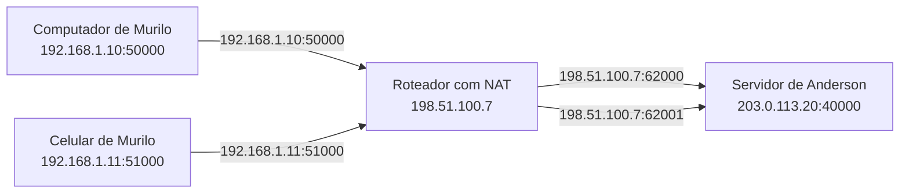

# Como o NAT muda a identidade de um pacote

O computador e o celular de Murilo estão na mesma rede e enviam pacotes para um servidor de Anderson. O computador usa a origem `192.168.1.10:50000`; o celular, `192.168.1.11:51000`. Quando os pacotes chegam ao servidor, as origens viraram `198.51.100.7:62000` e `198.51.100.7:62001`. O conteúdo útil pode ser o mesmo, mas as identidades usadas para receber as respostas mudaram no caminho.

Essa troca é o trabalho cotidiano do NAT doméstico. Mais precisamente, trata-se de Network Address and Port Translation, ou NAPT: o roteador traduz tanto o endereço IP quanto a porta.

## Endereço e porta identificam a conversa

O endereço IP indica uma interface na rede. A porta ajuda o sistema operacional a entregar o pacote à aplicação correta. A combinação dos dois forma um endpoint.

O computador e o celular têm endereços privados diferentes. Cada aplicação também escolhe uma porta de origem. O roteador aproveita essas diferenças para representar várias conversas e vários aparelhos por meio de um único endereço público.

Considere dois programas UDP que querem enviar dados ao servidor `203.0.113.20:40000`. Antes de atravessarem o roteador, os pacotes contêm:

| Aparelho | Endpoint de origem | Endpoint de destino | Protocolo |
|---|---|---|---|
| Computador | `192.168.1.10:50000` | `203.0.113.20:40000` | UDP |
| Celular | `192.168.1.11:51000` | `203.0.113.20:40000` | UDP |

Os endereços de origem são privados. Se chegassem intactos ao servidor, as respostas para `192.168.1.10` e `192.168.1.11` não encontrariam a casa de Murilo: esse bloco não é roteado na internet pública e pode ser usado em inúmeras redes locais.

## A tradução na saída

Ao receber os pacotes, o roteador escolhe uma representação externa para cada conversa. Seu endereço público é `198.51.100.7`; para distinguir os fluxos, ele seleciona as portas externas `62000` e `62001`.

Em seguida, registra a correspondência em uma tabela. É o [pequeno banco de dados apresentado no artigo anterior](2026-08-15-por-que-existe-nat.md): o roteador guarda estado suficiente para relacionar a identidade interna de Murilo à identidade externa observada pelo servidor de Anderson.

| Protocolo | Endpoint interno | Endpoint externo |
|---|---|---|
| UDP | `192.168.1.10:50000` | `198.51.100.7:62000` |
| UDP | `192.168.1.11:51000` | `198.51.100.7:62001` |



Os pacotes que entraram no roteador eram assim:

```text
192.168.1.10:50000  ->  203.0.113.20:40000
192.168.1.11:51000  ->  203.0.113.20:40000
```

Os pacotes enviados à internet ficam assim:

```text
198.51.100.7:62000  ->  203.0.113.20:40000
198.51.100.7:62001  ->  203.0.113.20:40000
```

Para o servidor de Anderson, o computador e o celular de Murilo são `198.51.100.7:62000` e `198.51.100.7:62001`. O servidor não enxerga diretamente os endereços privados, nem precisa saber que existe uma tradução. Ele apenas responde aos endpoints que observou como origem.

Alterar o cabeçalho exige recalcular campos de verificação afetados pela mudança. Esse detalhe importa para a implementação do roteador, mas não muda o princípio: o NAPT substitui a identidade local por uma identidade válida na internet e guarda informação suficiente para desfazer a troca.

## A tradução inversa na volta

O servidor responde aos dois endpoints:

```text
203.0.113.20:40000  ->  198.51.100.7:62000
203.0.113.20:40000  ->  198.51.100.7:62001
```

O endereço público leva os pacotes até o roteador de Murilo. As portas `62000` e `62001` permitem localizar as entradas corretas na tabela. O roteador então restaura os destinos internos:

```text
203.0.113.20:40000  ->  192.168.1.10:50000
203.0.113.20:40000  ->  192.168.1.11:51000
```

O computador recebe o primeiro pacote e o entrega ao programa que mantém o socket UDP na porta `50000`. O celular faz o mesmo com a porta `51000`. Para as aplicações, as conversas continuam entre suas portas locais e o servidor de Anderson. Elas não precisam saber quais portas externas foram escolhidas.

É assim que dezenas de aparelhos compartilham um endereço público sem misturar respostas. Cada fluxo recebe uma correspondência adequada, distinguida pelo protocolo, pelos endpoints e pelas regras do equipamento.

## A tabela tem prazo

Uma entrada de tradução ocupa estado no roteador e não pode permanecer para sempre. Se não houver tráfego durante determinado período, ela expira. O valor desse prazo varia entre equipamentos e protocolos.

Depois da expiração, um pacote destinado a `198.51.100.7:62000` já não encontra a correspondência com `192.168.1.10:50000`. Uma nova saída de Murilo pode criar outra entrada, talvez com uma porta externa diferente.

Isso afeta aplicações P2P que mantêm uma comunicação UDP pouco ativa. Elas podem enviar pacotes periódicos para conservar a tradução enquanto a sessão for necessária. Essa manutenção não torna a porta permanente; apenas evita que uma correspondência ainda útil pareça abandonada.

## Basic NAT e NAPT não são iguais

NAT é um termo amplo. No chamado Basic NAT, a tradução troca endereços, mas não depende de traduzir portas para multiplicar conversas. Ainda são necessários endereços públicos suficientes para representar os hosts traduzidos.

O NAPT acrescenta a porta à tradução. É essa variante que permite colocar computadores, telefones e outros aparelhos atrás de um único IPv4 público. No uso cotidiano, quase todo mundo chama o NAPT doméstico simplesmente de NAT. A abreviação é conveniente, desde que não esconda o papel das portas.

## Tradução não é permissão

A existência de uma linha na tabela responde a uma pergunta: qual endpoint interno corresponde a este endpoint externo? Ela não responde, sozinha, a outra pergunta importante: quais origens podem enviar pacotes por esse caminho?

Essa segunda decisão pertence ao filtering, normalmente aplicado junto das regras de firewall. Um equipamento pode manter a tradução `198.51.100.7:62000` e aceitar somente respostas de destinos que Murilo contatou. Outro pode adotar uma política mais aberta. Em ambos os casos, a troca de endereço e porta continua sendo NAT; a aceitação ou rejeição do pacote é uma decisão de filtro.

As funções parecem uma só porque vivem na mesma caixa e usam estado relacionado. Ainda assim, a distinção evita uma conclusão enganosa: NAT não é sinônimo de firewall. Traduzir permite compartilhar endereços; filtrar controla quem atravessa a fronteira.

Para um peer, essa diferença é prática. Descobrir a própria identidade externa informa para onde outro peer tentará enviar. Não garante que o pacote será aceito. A tabela explica o caminho de volta; a política de filtro decide se esse caminho pode ser usado por aquela origem.

## Referências

- [RFC 2663: IP Network Address Translator Terminology and Considerations](https://www.rfc-editor.org/rfc/rfc2663)
- [RFC 3022: Traditional IP Network Address Translator](https://www.rfc-editor.org/rfc/rfc3022)
- [RFC 4787: NAT Behavioral Requirements for Unicast UDP](https://www.rfc-editor.org/rfc/rfc4787)