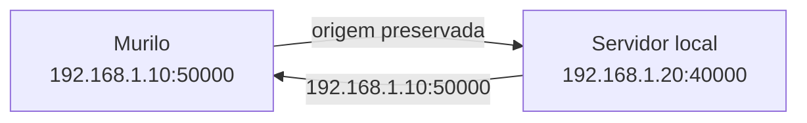
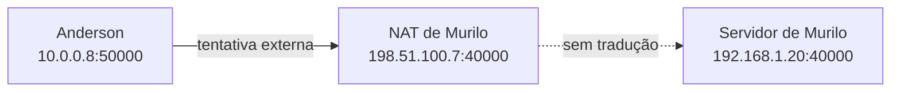
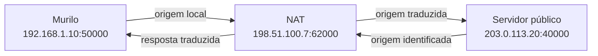

# Observando o NAT na prática com Rust

Nos artigos anteriores, partimos da escassez de endereços IPv4, entendemos por que endereços privados podem se repetir e tratamos o NAT como uma pequena tabela de traduções no roteador. Depois acompanhamos no papel um pacote que saiu de `192.168.1.10:50000` e chegou à internet como `198.51.100.7:62000`.

Agora vamos reunir essas ideias em um experimento. Usaremos programas pequenos em Rust, apenas com a biblioteca padrão, para confirmar quatro pontos:

1. endereço IP e porta formam o endpoint usado pelo programa;
2. endereços privados funcionam dentro da rede local, mas não identificam uma casa na internet;
3. iniciar um servidor atrás do NAT não o torna acessível do lado de fora;
4. quando o cliente envia para um servidor público, o NAT troca sua origem e guarda o caminho da resposta.

O experimento terá duas peças:

- um cliente UDP em Rust;
- um servidor UDP em Rust, executado primeiro localmente e depois em uma máquina pública.

O código completo está em [`code/2026-08-16-observando-o-nat-na-pratica-com-rust/`](../../code/2026-08-16-observando-o-nat-na-pratica-com-rust/). Os trechos abaixo são os mesmos arquivos do projeto, apresentados separadamente para acompanhar cada etapa.

## Um servidor UDP que responde com o endpoint do cliente

O servidor precisa fazer pouco. Ele escuta na porta `40000`, recebe um datagrama e obtém do sistema operacional o endpoint de origem. Depois envia uma resposta contendo esse endpoint.

O primeiro binário está em `src/bin/server.rs`:

```rust
use std::io;
use std::net::UdpSocket;

fn main() -> io::Result<()> {
    let socket = UdpSocket::bind("0.0.0.0:40000")?;
    let local = socket.local_addr()?;
    println!("servidor iniciado em {local}");

    let mut buffer = [0_u8; 1024];

    loop {
        let (size, source) = socket.recv_from(&mut buffer)?;
        let message = String::from_utf8_lossy(&buffer[..size]);

        println!("recebido de {source}: {message}");
        socket.send_to(source.to_string().as_bytes(), source)?;
    }
}
```

`UdpSocket::bind` cria o socket e reserva a porta local. O endereço `0.0.0.0` não é um endereço para divulgar a outro peer; ele pede ao sistema operacional que aceite datagramas destinados a qualquer interface IPv4 desta máquina.

O ponto central está em `recv_from`. Além da quantidade de bytes recebidos, ele retorna um `SocketAddr` chamado `source`. Essa é a origem que chegou ao servidor. O servidor não precisa adivinhar nem confiar em um endereço escrito dentro da mensagem.

Compile e execute com Cargo:

```console
$ cargo run --bin server
servidor iniciado em 0.0.0.0:40000
```

## Um cliente que mostra seu endpoint local

O cliente em `src/bin/client.rs` abre a porta UDP `50000`, conecta o socket ao endereço informado na linha de comando, envia uma mensagem e espera a resposta:

```rust
use std::env;
use std::io;
use std::net::UdpSocket;
use std::time::Duration;

fn main() -> io::Result<()> {
    let server = env::args()
        .nth(1)
        .unwrap_or_else(|| "127.0.0.1:40000".to_string());

    let socket = UdpSocket::bind("0.0.0.0:50000")?;
    socket.connect(&server)?;
    socket.set_read_timeout(Some(Duration::from_secs(3)))?;

    println!("endpoint local: {}", socket.local_addr()?);
    println!("destino: {}", socket.peer_addr()?);

    socket.send(b"ola")?;

    let mut buffer = [0_u8; 1024];
    let size = socket.recv(&mut buffer)?;
    let observed = String::from_utf8_lossy(&buffer[..size]);

    println!("origem identificada pelo servidor: {observed}");
    Ok(())
}
```

Chamar `connect` em um socket UDP não cria uma conexão como o TCP. Não há handshake. O sistema apenas associa um destino padrão ao socket e permite usar `send` e `recv` em vez de repetir o endereço em `send_to` e `recv_from`.

Há outro efeito útil para o experimento: depois de conhecer o destino, o sistema operacional escolhe qual interface será usada para alcançá-lo. Por isso consultamos `local_addr` após `connect`.

Com o servidor ainda em execução, abra outro terminal e faça o primeiro teste:

```console
$ cargo run --bin client -- 127.0.0.1:40000
endpoint local: 127.0.0.1:50000
destino: 127.0.0.1:40000
origem identificada pelo servidor: 127.0.0.1:50000
```

O pacote não saiu da máquina. A interface de loopback preservou a origem que o cliente conhece.

## O teste dentro da rede local

Agora o servidor pode ser executado em outro computador da mesma rede. Suponha que ele tenha o endereço `192.168.1.20`. O cliente passa a usar esse endereço como destino:

```console
$ cargo run --bin client -- 192.168.1.20:40000
endpoint local: 192.168.1.10:50000
destino: 192.168.1.20:40000
origem identificada pelo servidor: 192.168.1.10:50000
```

Os dois computadores entendem o bloco `192.168.1.0/24` porque participam da mesma rede local. Nenhum pacote precisou atravessar o NAT. O servidor identifica o endpoint privado do cliente como origem.



Se Anderson estiver em outra casa e tentar usar `192.168.1.10:50000`, esse endereço não o levará até Murilo. Ele pode até existir na rede de Anderson, identificando outra máquina. Endereços privados são úteis dentro do domínio em que foram atribuídos, não como identidade global.

## O servidor atrás do NAT não aparece na internet

Agora Murilo mantém o servidor em execução dentro de sua rede, em `192.168.1.20:40000`, e informa a Anderson apenas o endereço público de seu roteador: `198.51.100.7`.

Anderson tenta enviar para a mesma porta:

```console
$ cargo run --bin client -- 198.51.100.7:40000
endpoint local: 10.0.0.8:50000
destino: 198.51.100.7:40000
Error: Os { code: 11, kind: WouldBlock, message: "Resource temporarily unavailable" }
```

A mensagem exata varia entre sistemas operacionais. Neste exemplo, a tentativa termina no timeout configurado no cliente, e o servidor de Murilo não recebe o datagrama.

O motivo não é uma limitação do programa em Rust. O pacote de Anderson chega ao roteador de Murilo destinado a `198.51.100.7:40000`, mas o NAT não possui uma entrada que associe essa porta pública a `192.168.1.20:40000`. Também não pode escolher arbitrariamente uma máquina da rede local para receber o pacote.



Essa tentativa poderia funcionar se Murilo configurasse um redirecionamento da porta UDP `40000`, se algum mecanismo criasse essa regra no roteador ou se já existisse estado compatível com a origem de Anderson. Sem uma dessas condições, iniciar o servidor em `0.0.0.0:40000` abre a porta apenas nas interfaces da própria máquina; isso não publica o serviço automaticamente no endereço do roteador.

## O mesmo servidor, agora fora da rede

Vamos inverter a topologia. O programa `server.rs` não precisa mudar, mas agora será executado em uma máquina com endereço IPv4 público e com a porta UDP `40000` liberada no firewall do sistema e nas regras do provedor.

Suponha que o servidor público use `203.0.113.20`. Murilo executa:

```console
$ cargo run --bin client -- 203.0.113.20:40000
endpoint local: 192.168.1.10:50000
destino: 203.0.113.20:40000
origem identificada pelo servidor: 198.51.100.7:62000
```

Agora os dois valores diferem:

| Ponto de observação | Endpoint |
|---|---|
| Cliente de Murilo | `192.168.1.10:50000` |
| Servidor público | `198.51.100.7:62000` |

Desta vez Murilo iniciou a troca para fora da rede. Seu roteador substituiu o endereço e a porta de origem, registrou a tradução e enviou o datagrama ao servidor público. O servidor respondeu ao endpoint que viu, e a tabela do NAT permitiu que a resposta voltasse ao socket local correto.



O endereço `198.51.100.7` e os demais endereços públicos deste artigo pertencem a blocos reservados para documentação. Uma execução real mostrará os endereços atribuídos às máquinas usadas no teste.

## O que os testes confirmaram

Os programas não simulam o NAT. Eles mostram os endpoints que o sistema operacional conhece e a origem que realmente chega ao servidor. Juntando os resultados:

| Teste | Resultado | Conceito confirmado |
|---|---|---|
| Cliente e servidor na mesma máquina | `127.0.0.1:50000` nos dois lados | Loopback não atravessa a rede |
| Duas máquinas na mesma rede local | `192.168.1.10:50000` nos dois lados | O endpoint privado vale dentro da rede local |
| Servidor atrás do NAT, cliente do lado de fora | A tentativa falha sem uma regra ou tradução compatível | O endereço público do roteador não publica o servidor interno |
| Cliente atrás do NAT, servidor público | O servidor vê `198.51.100.7:62000` | O NAPT traduz endereço e porta e mantém estado para a resposta |

O último teste também torna concreta a analogia do pequeno banco de dados. A resposta chega a `198.51.100.7:62000`, e o roteador usa a tradução criada na saída para entregá-la a `192.168.1.10:50000`.

## O que ainda não demonstramos

O servidor público conseguiu responder porque Murilo enviou primeiro. Esse teste mostra uma tradução ativa e um caminho de resposta entre dois endpoints específicos. Ele não prova que Anderson poderá enviar para `198.51.100.7:62000`.

O roteador pode reutilizar a mesma identidade externa quando Murilo troca o servidor por Anderson, ou pode escolher outra porta. Também pode aceitar pacotes apenas do endereço que Murilo já contatou. O cliente não descobre essas decisões olhando para `local_addr`, e uma única observação do servidor não descreve todas elas.

Foi justamente isso que o experimento tornou visível: existem dois pontos de vista sobre o mesmo socket.

```text
O programa conhece:      192.168.1.10:50000
O servidor identifica:   198.51.100.7:62000
```

No próximo artigo, vamos variar o destino sem trocar o socket. Assim poderemos separar duas perguntas que ficaram abertas: qual endpoint externo o NAT escolhe e quais origens ele deixa usar o caminho de volta?

## Referências

- [Rust: `std::net::UdpSocket`](https://doc.rust-lang.org/std/net/struct.UdpSocket.html)
- [RFC 5737: IPv4 Address Blocks Reserved for Documentation](https://www.rfc-editor.org/rfc/rfc5737)