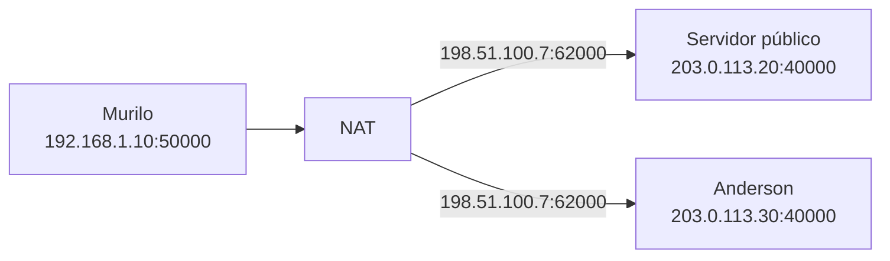
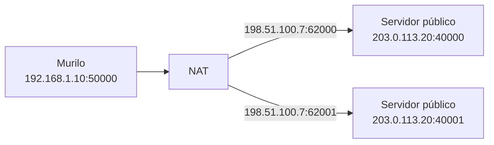
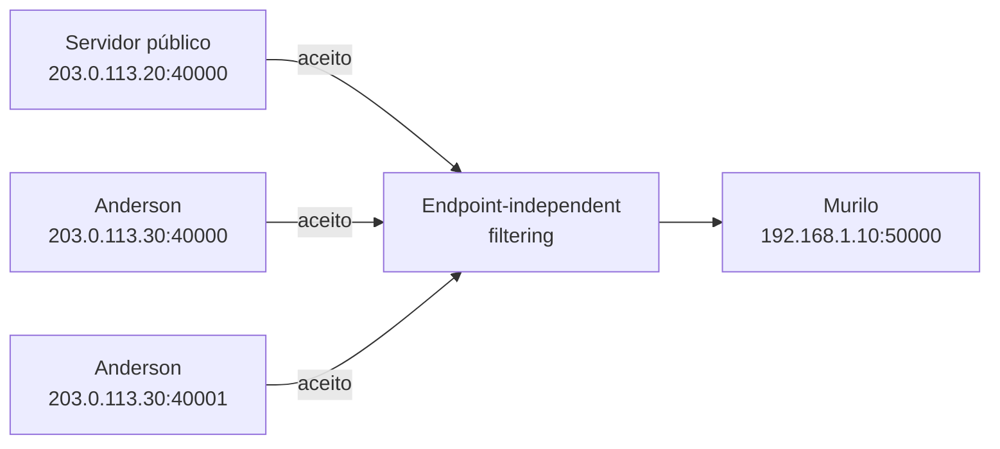
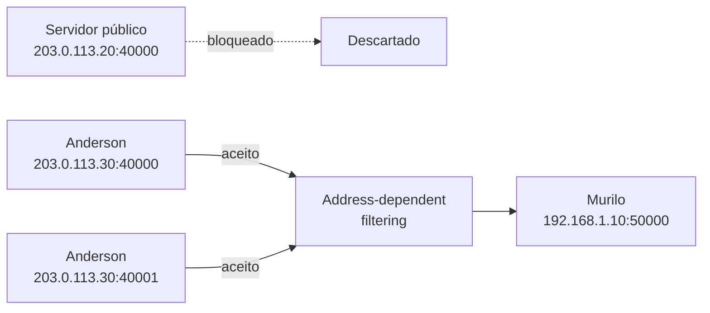
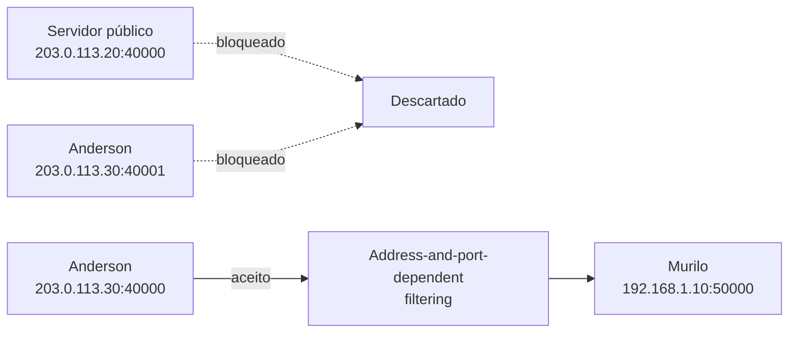

# Por que nem todo NAT se comporta igual

No [experimento anterior](2026-08-16-observando-o-nat-na-pratica-com-rust.md), o cliente de Murilo usou o endpoint local `192.168.1.10:50000`, enquanto o servidor público identificou sua origem como `198.51.100.7:62000`. Também vimos a tentativa inversa falhar: Anderson não conseguiu iniciar uma troca com um servidor dentro da rede de Murilo porque o roteador não tinha uma tradução que indicasse a máquina de destino.

O teste deixou duas perguntas abertas. O que acontece quando Murilo usa o mesmo socket UDP para falar com outro destino? Depois que existe uma tradução, quais origens podem enviar pacotes de volta por ela?

A resposta depende do roteador. Um pode manter o endpoint externo `198.51.100.7:62000`; outro pode escolher uma nova porta. Mesmo quando a porta permanece igual, um roteador pode aceitar pacotes de qualquer origem, enquanto outro aceita somente pacotes de um endereço e de uma porta que Murilo já contatou.

Essas decisões podem ser descritas por dois comportamentos: **mapping**, que determina a identidade externa, e **filtering**, que determina quais origens podem usar o caminho de volta.

## Mapping: qual identidade aparece fora?

Continuando o experimento, Murilo envia primeiro um pacote ao servidor público, em `203.0.113.20:40000`. Seu roteador o apresenta como `198.51.100.7:62000`. Depois, usando o mesmo socket UDP, ele envia ao endpoint externo de Anderson, em `203.0.113.30:40000`.

Um NAT com **endpoint-independent mapping** reutiliza a identidade externa enquanto o mapeamento estiver ativo:

```text
192.168.1.10:50000 -> 203.0.113.20:40000  => 198.51.100.7:62000
192.168.1.10:50000 -> 203.0.113.30:40000  => 198.51.100.7:62000
```

O destino não participa da decisão. Pacotes enviados pelo mesmo endpoint interno para qualquer endereço e porta externos reutilizam o mesmo mapeamento.

No **address-dependent mapping**, o endereço IP de destino também participa. Enviar para duas portas do servidor público reutiliza o mapeamento, mas trocar para o endereço de Anderson cria outro:

```text
192.168.1.10:50000 -> 203.0.113.20:40000  => 198.51.100.7:62000
192.168.1.10:50000 -> 203.0.113.20:40001  => 198.51.100.7:62000
192.168.1.10:50000 -> 203.0.113.30:40000  => 198.51.100.7:62001
```

No **address-and-port-dependent mapping**, tanto o endereço quanto a porta de destino participam. Trocar de `203.0.113.20:40000` para `203.0.113.20:40001` já cria outro mapeamento:

```text
192.168.1.10:50000 -> 203.0.113.20:40000  => 198.51.100.7:62000
192.168.1.10:50000 -> 203.0.113.20:40001  => 198.51.100.7:62001
```

Os diagramas mostram os três comportamentos separadamente. Em todos os casos, Murilo usa o mesmo endpoint interno; o que muda é a participação do destino na escolha da porta externa.

**Endpoint-independent mapping:**



**Address-dependent mapping:**


**Address-and-port-dependent mapping:**



Para P2P, essa reutilização é decisiva. Se o servidor público identifica Murilo como `198.51.100.7:62000` e informa esse endpoint a Anderson, a informação só será útil se o roteador mantiver uma identidade compatível quando o destino mudar do servidor para Anderson. Com mapping dependente do destino, o endpoint identificado pelo servidor pode deixar de representar Murilo justamente quando outro peer tenta usá-lo.

## Filtering: quem pode enviar de volta?

O mapping pode permanecer igual e o filtering mudar. Suponha que `198.51.100.7:62000` continue representando Murilo ao falar com qualquer destino.

Com **endpoint-independent filtering**, qualquer origem pode enviar para esse endpoint enquanto a tradução existir. Uma saída de Murilo é suficiente para permitir o caminho de volta, independentemente do endereço e da porta de origem dos pacotes recebidos.

Com **address-dependent filtering**, o pacote só é aceito se vier de um endereço IP que Murilo já contatou. Se ele enviou para `203.0.113.30:40000`, pacotes vindos de `203.0.113.30` podem passar mesmo que usem outra porta.

Com **address-and-port-dependent filtering**, a origem precisa coincidir com o endereço e a porta exatos para os quais Murilo enviou. Ter enviado para `203.0.113.30:40000` não autoriza automaticamente pacotes vindos de `203.0.113.30:40001`.

Suponha que Murilo tenha enviado apenas para Anderson em `203.0.113.30:40000`. O mesmo pacote de saída abre permissões diferentes, dependendo do filtering.

**Endpoint-independent filtering:**



**Address-dependent filtering:**



**Address-and-port-dependent filtering:**



Mapping e filtering são eixos separados. Um roteador pode reutilizar a mesma porta externa para todos os destinos e ainda aplicar o filtro mais restritivo. Outro pode criar um mapeamento por destino e usar uma política de entrada diferente. Saber apenas que há NAT não permite deduzir o conjunto completo.

Essa separação também corrige uma intuição comum: endpoint-independent mapping não deixa o peer interno automaticamente mais exposto. O mapping decide como o endpoint aparece. É o filtering que decide quais pacotes entram.

## A classificação clássica

Os nomes *full cone*, *restricted cone*, *port-restricted cone* e *symmetric NAT* ainda aparecem em documentação e conversas sobre P2P. A RFC 3489 os usou para classificar comportamentos de NAT aplicáveis a UDP. Eles ajudam a formar uma primeira imagem, mas combinam mapping e filtering em quatro pacotes prontos.

No **full cone**, o mapping é independente do destino e o filtering é independente da origem. Murilo mantém a mesma identidade externa, e qualquer origem pode enviar para ela enquanto a tradução existir.

No **restricted cone**, o mapping também permanece estável, mas o filtro exige que Murilo tenha enviado antes para o endereço IP de origem. A porta usada por essa origem não faz parte da restrição.

No **port-restricted cone**, o mapping continua estável, porém o filtro exige o endereço e a porta previamente contatados. A diferença para o restricted cone está na precisão da permissão de entrada, não na identidade externa.

No **symmetric NAT**, o mesmo endpoint interno recebe um mapeamento diferente para cada destino. Na definição clássica, somente o destino que recebeu um pacote pode enviar de volta por aquele mapeamento. A porta identificada pelo servidor público, portanto, pode não ser a porta usada quando Murilo envia para Anderson.

| Tipo clássico | Mapping | Filtering |
|---|---|---|
| Full cone | Independente do destino | Qualquer origem |
| Restricted cone | Independente do destino | Endereço já contatado |
| Port-restricted cone | Independente do destino | Endereço e porta já contatados |
| Symmetric NAT | Dependente do destino | Destino já contatado |

Essa tabela preserva uma intuição útil: os três tipos cone mantêm a identidade externa no modelo clássico, enquanto o symmetric NAT pode alterá-la. O problema começa quando esses quatro nomes são tratados como uma descrição completa de equipamentos reais.

## Por que separar os comportamentos ajuda

A própria RFC 4787 abandonou a classificação cone/symmetric porque ela se mostrou insuficiente para descrever NATs encontrados na prática. Mapping e filtering podem aparecer em combinações que os quatro tipos clássicos não expressam bem.

Esses dois eixos também não descrevem tudo. Um NAT pode tentar preservar a porta interna quando ela está livre e escolher outra quando há conflito. Pode usar tempos diferentes para expirar mapeamentos, tratar UDP e TCP de formas distintas ou operar atrás de outra tradução feita pelo provedor. Mapping e filtering respondem às duas perguntas centrais deste artigo, mas não substituem a medição do comportamento completo da rede.

A separação permite fazer perguntas testáveis:

- O mesmo socket UDP recebe o mesmo endpoint externo quando muda o destino?
- A permissão de entrada depende de qualquer saída, do endereço contatado ou do endereço e da porta?
- Por quanto tempo o mapeamento e a permissão permanecem válidos sem tráfego?

Os quatro tipos clássicos ainda servem como atalhos em uma conversa. Para projetar ou diagnosticar uma aplicação, descrever cada comportamento é mais útil porque mostra onde a conectividade se rompe.

## O efeito sobre peers

Uma aplicação P2P precisa informar a um peer um endpoint que continue válido quando esse peer tentar usá-lo. Endpoint-independent mapping favorece essa reutilização. Mapping dependente do endereço ou do endereço e da porta reduz a chance de o endpoint identificado por um servidor servir para a comunicação com outro peer.

O filtering impõe uma condição diferente. Mesmo com a identidade externa correta, o pacote pode ser descartado até que o peer interno envie algo para a origem esperada. Uma porta estável não significa filtro aberto, e um filtro permissivo não corrige uma porta que mudou.

Agora já temos as duas peças necessárias para entender a próxima etapa. Se Murilo e Anderson conhecerem os endpoints externos um do outro e ambos enviarem pacotes na direção oposta, cada saída poderá criar o mapeamento e a permissão de que a entrada precisa. Essa coordenação é a base do UDP hole punching. Ela funciona em muitas redes, mas o resultado depende exatamente dos comportamentos que acabamos de separar.

## Referências

- [RFC 3489: STUN](https://www.rfc-editor.org/rfc/rfc3489) — apresenta a classificação clássica de NATs, posteriormente considerada insuficiente como modelo geral.
- [RFC 4787: NAT Behavioral Requirements for Unicast UDP](https://www.rfc-editor.org/rfc/rfc4787) — define os comportamentos de mapping e filtering usados neste artigo.
- [RFC 5128: State of P2P Communication across NATs](https://www.rfc-editor.org/rfc/rfc5128) — relaciona esses comportamentos às técnicas de NAT traversal usadas por aplicações P2P.
- [RFC 7857: Updates to NAT Behavioral Requirements](https://www.rfc-editor.org/rfc/rfc7857) — esclarece e atualiza requisitos de comportamento para NAT44.