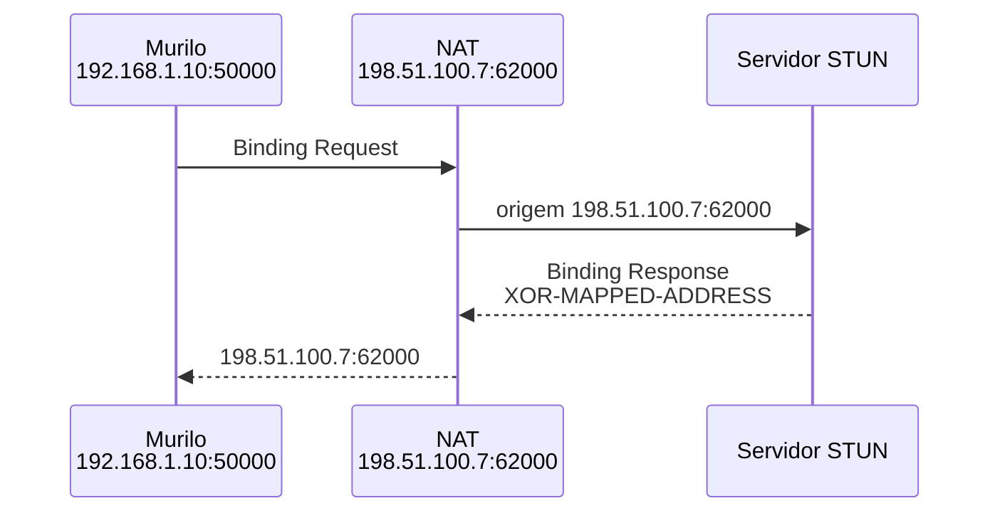

# Como descobrir seu endpoint externo com STUN

No experimento de UDP hole punching, Murilo e Anderson trocaram seus endereços públicos manualmente e presumiram que os NATs preservariam a porta local `50000`. Se o roteador de Murilo escolher `62000`, Anderson tentará `198.51.100.7:50000` e enviará para o endpoint errado.

Murilo não descobre essa porta consultando `local_addr`: o sistema operacional conhece `192.168.1.10:50000`, não a tradução criada no roteador. Ele precisa enviar pelo próprio socket a uma máquina fora da rede e perguntar qual origem chegou do outro lado.

STUN padroniza essa pergunta. Em vez de presumir a porta externa, Murilo obtém `198.51.100.7:62000` e pode entregar o valor correto a Anderson. Isso corrige a descoberta do endpoint; não remove as restrições de mapping e filtering explicadas nos artigos anteriores.

STUN significa **Session Traversal Utilities for NAT**. A especificação atual é a [RFC 8489](https://www.rfc-editor.org/rfc/rfc8489). O nome descreve bem seu lugar: STUN é uma ferramenta usada por outros mecanismos, não uma solução completa para atravessar qualquer NAT.

## Uma pergunta e uma observação

Murilo envia uma **Binding Request** ao servidor STUN usando o socket UDP da porta `50000`. O NAT cria ou reutiliza uma tradução, troca a origem e encaminha o pacote. O servidor responde com uma **Binding Response** contendo o atributo `XOR-MAPPED-ADDRESS`.



O valor é codificado com uma operação XOR usando dados da própria mensagem. Isso evita que alguns dispositivos antigos alterem o endereço por reconhecerem seu formato no payload. Para entender o fluxo, porém, basta ler o atributo como: "seu pacote chegou com este IP e esta porta".

Esse par recebe o nome de **server-reflexive transport address**. Ele não é um endereço permanente de Murilo. É a tradução que o NAT apresentou àquele servidor naquele instante. Se a entrada expirar, a porta externa mudar ou houver outro NAT no caminho, o resultado também pode mudar.

## Usando um servidor STUN público

Para um teste real, podemos consultar um serviço público compatível com o padrão. A Cloudflare documenta `stun.cloudflare.com` nas portas UDP `3478` e `53`; a porta principal é `3478`.

O cliente precisa enviar uma Binding Request STUN válida e interpretar `XOR-MAPPED-ADDRESS`. Não basta enviar texto para a porta `3478`, porque STUN define cabeçalho binário, transaction ID, atributos, regras de codificação e validação da resposta.

Usar um servidor público evita implantar infraestrutura para o experimento, mas cria uma dependência externa. Para produção, é preciso verificar os termos, limites e disponibilidade do serviço escolhido em vez de presumir que um endpoint público é uma API permanente.

## Consultando STUN antes do hole punching

O código completo está em [`code/2026-08-18-como-descobrir-seu-endpoint-externo-com-stun/`](../../../code/2026-08-18-como-descobrir-seu-endpoint-externo-com-stun/). Ele usa a crate `stunclient` para gerar e interpretar as mensagens da RFC 8489.

O fluxo importante cabe em poucas linhas:

```rust
let socket = UdpSocket::bind("0.0.0.0:50000")?;
let stun_server = resolve_stun_server()?;
let external = StunClient::new(stun_server)
  .query_external_address(&socket)
  .map_err(|error| io::Error::other(error.to_string()))?;

println!("socket local: {}", socket.local_addr()?);
println!("endpoint externo: {external}");
println!("envie o endpoint externo ao outro peer");

let remote = read_remote_endpoint()?;
punch(&socket, remote)
```

Cada peer executa:

```console
$ cargo run --release
socket local: 0.0.0.0:50000
endpoint externo: 198.51.100.7:62000
envie o endpoint externo ao outro peer
endpoint externo do outro peer:
```

Murilo copia `198.51.100.7:62000` para Anderson. Anderson copia o endpoint retornado em sua rede para Murilo. Cada um cola o valor recebido no terminal, e o programa continua com as mesmas tentativas de hole punching do artigo anterior.

`0.0.0.0:50000` indica que o socket aceita datagramas destinados a qualquer interface IPv4 local. Não é um endereço para compartilhar com Anderson. O valor útil para a tentativa é o endpoint externo retornado por STUN.

O socket não é fechado entre a consulta e as tentativas. Essa continuidade é essencial: o endpoint retornado por STUN corresponde ao socket que permanece aguardando os pacotes do outro peer.

## Um refletor UDP próprio também resolve a medição

O servidor Rust do experimento anterior já continha a ideia mínima: receber um datagrama, ler o `SocketAddr` de origem e devolver `IP:porta`. Executado em uma máquina pública, ele permite que Murilo descubra `198.51.100.7:62000` pelo mesmo socket que usará no hole punching.

Isso resolve a necessidade específica da aplicação, mas não transforma o programa em um servidor STUN. Um servidor STUN padrão precisa entender as mensagens e os atributos definidos pela RFC 8489, gerar respostas compatíveis e seguir suas regras de processamento.

Um refletor próprio pode ser uma escolha válida em um sistema fechado quando controlamos cliente e servidor e precisamos apenas desse resultado. Também permite autenticação, rate limiting e um formato ajustado ao protocolo da aplicação. O custo é perder interoperabilidade com bibliotecas e ferramentas STUN existentes, além de assumir manutenção, disponibilidade e proteção contra abuso.

Usar um protocolo diferente ainda reduz varreduras automáticas feitas especificamente para STUN, mas isso não é uma garantia de segurança nem deve ser o controle principal. O serviço continua público e precisa autenticação quando aplicável, limites de tráfego e validação de mensagens.

## O socket precisa ser o mesmo

A porta local faz parte da medição. Se Murilo consulta STUN usando o socket UDP `192.168.1.10:50000`, mas abre outro socket para falar com Anderson, o NAT pode criar outra tradução.

```text
socket da consulta STUN: 192.168.1.10:50000 -> 198.51.100.7:62000
socket novo da aplicação: 192.168.1.10:50001 -> 198.51.100.7:62037
```

Divulgar `198.51.100.7:62000` e depois esperar dados em outro socket quebra a associação entre a medição e o tráfego real. Por isso, aplicações de NAT traversal fazem a consulta e os testes pelo mesmo socket que pretendem usar.

Mesmo assim, o resultado não é uma promessa de que Anderson conseguirá responder. `XOR-MAPPED-ADDRESS` informa como o servidor STUN recebeu o pacote de Murilo. O NAT ainda pode filtrar pacotes de Anderson ou produzir outra tradução quando o destino muda.

## Destinos diferentes ajudam a medir mapping

Uma consulta STUN responde como o NAT representou o socket diante de um destino. Para saber se essa representação muda, Murilo precisa repetir o teste pelo mesmo socket contra outros destinos STUN.

Duas consultas a servidores diferentes oferecem uma comparação inicial:

```text
STUN A: 192.168.1.10:50000 -> 198.51.100.7:62000
STUN B: 192.168.1.10:50000 -> 198.51.100.7:62000
```

Resultados iguais são evidência de endpoint-independent mapping para aqueles destinos e naquele momento. Se a segunda consulta retornar outra porta, existe evidência de mapping dependente do destino. Dois servidores independentes, porém, não bastam para distinguir com precisão mapping de endereço versus mapping de endereço-e-porta.

A [RFC 5780](https://www.rfc-editor.org/rfc/rfc5780) define uma topologia coordenada para isso. O servidor oferece dois endereços IP e duas portas e informa a alternativa no atributo `OTHER-ADDRESS`.

| Teste | Destino | Comparação |
|---|---|---|
| I | IP A, porta 1 | Obtém o primeiro `XOR-MAPPED-ADDRESS` |
| II | IP B, porta 1 | Igual ao I indica endpoint-independent mapping |
| III | IP B, porta 2 | Igual ao II indica address-dependent; diferente indica address-and-port-dependent |

O terceiro teste só é necessário quando o resultado muda entre I e II. Todos usam o mesmo socket do cliente.

## Filtering exige respostas de origens diferentes

Filtering não é medido comparando apenas os endpoints retornados. O teste precisa verificar se uma resposta entra quando parte de um IP ou de uma porta que Murilo ainda não contatou.

Na RFC 5780, o cliente envia a solicitação ao endereço principal e usa `CHANGE-REQUEST` para pedir que a resposta saia de outra origem:

| Teste | Origem solicitada para a resposta | Resultado |
|---|---|---|
| I | IP A, porta 1 | Confirma conectividade UDP e fornece `OTHER-ADDRESS` |
| II | IP B, porta 2 | Se chegar, o filtering é endpoint-independent |
| III | IP A, porta 2 | Se chegar, é address-dependent; se não, address-and-port-dependent |

Esses testes são sensíveis ao estado anterior do NAT. Antes do teste II, o cliente não pode ter criado uma permissão ao enviar para o endereço alternativo. O servidor também precisa controlar as origens das respostas e informar `RESPONSE-ORIGIN` e `OTHER-ADDRESS`.

Por isso, consultar dois servidores STUN públicos comuns não identifica filtering de forma confiável. Eles não necessariamente compartilham a topologia nem permitem pedir que uma resposta venha do IP e da porta do outro. É necessário um serviço compatível com o usage experimental da RFC 5780 ou uma infraestrutura coordenada equivalente.

## Medição não é garantia

Depois da consulta básica, Murilo troca `198.51.100.7:62000` com Anderson e os dois repetem as saídas coordenadas. Agora não dependem da suposição de que a porta externa é igual à interna.

Isso melhora o experimento, mas não faz a conexão funcionar independentemente do filtering. Em filtros dependentes de endereço ou de endereço e porta, cada peer ainda precisa enviar primeiro para a origem esperada. Mapping dependente do destino também pode fazer o endpoint identificado pelo servidor STUN mudar quando Murilo envia para Anderson.

Mesmo os testes da RFC 5780 descrevem comportamento transitório entre aquele socket e aquela infraestrutura no instante da medição. NATs podem mudar sob carga, conflitos de porta ou novas traduções. O resultado ajuda no diagnóstico e na escolha do que tentar primeiro; não substitui um teste com o peer real.

É por isso que a RFC 3489 e seus quatro rótulos clássicos foram abandonados como modelo geral. Mapping e filtering devem ser medidos separadamente, e aplicações que precisam de conectividade confiável devem manter um caminho alternativo.

## O que STUN realmente entrega

Ao terminar a Binding transaction, Murilo aprendeu o endpoint que aquele servidor recebeu. Essa informação pode ser copiada para Anderson e usada em uma nova tentativa de hole punching. Ainda falta verificar se o caminho entre os dois funciona.

Essa limitação não diminui STUN. Ela define sua utilidade com precisão: observar em vez de adivinhar. Um endereço observado é evidência sobre uma tradução existente. Transformá-lo em uma conexão exige testes feitos com o peer real.

Depois que Murilo e Anderson conseguem medir os próprios endpoints, sobra um trabalho manual: um ainda precisa encontrar o outro e entregar essa informação. O próximo artigo automatiza essa apresentação com rendezvous e sinalização.

## Referências

- [RFC 3489: STUN clássico, obsoleta](https://www.rfc-editor.org/rfc/rfc3489)
- [RFC 5780: NAT Behavior Discovery Using STUN](https://www.rfc-editor.org/rfc/rfc5780)
- [RFC 8489: Session Traversal Utilities for NAT](https://www.rfc-editor.org/rfc/rfc8489)
- [Cloudflare Realtime: STUN and TURN service addresses](https://developers.cloudflare.com/calls/turn/)
