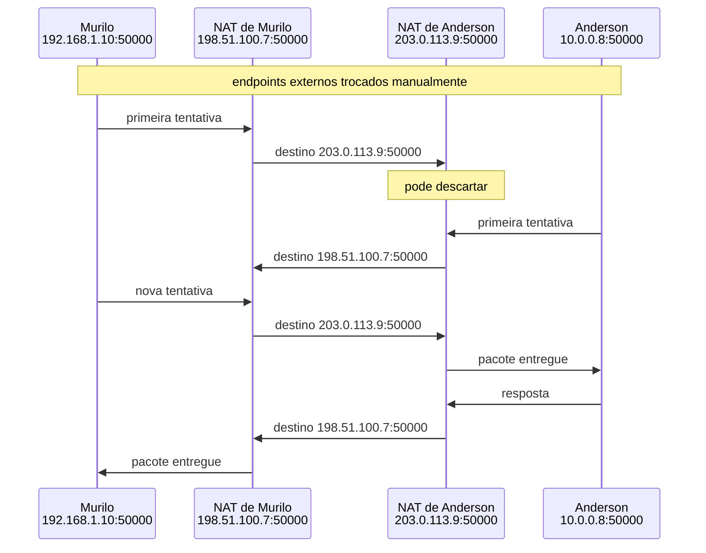

# Como funciona UDP hole punching

Foi para chegar a este ponto que começamos pela origem do NAT, seguimos um pacote através da tradução, executamos um experimento em Rust e separamos mapping de filtering. UDP hole punching combina essas peças para tentar aquilo que falhou no primeiro teste: fazer dois peers atrás de NATs trocarem pacotes diretamente.

No [experimento prático](2026-08-16-observando-o-nat-na-pratica-com-rust.md), Anderson tentou iniciar uma troca com um servidor na rede de Murilo. O pacote chegou ao roteador, mas não havia uma tradução que apontasse para a máquina interna. Depois, quando Murilo enviou para um servidor público, o roteador criou estado e a resposta encontrou o caminho de volta.

Ao [separar mapping de filtering](2026-08-17-por-que-nem-todo-nat-se-comporta-igual.md), encontramos as outras duas condições. O mapping precisa produzir um endpoint que continue útil quando o destino muda do servidor público para o outro peer. O filtering precisa aceitar o pacote depois que o peer interno envia para a origem esperada.

Agora Murilo e Anderson estão atrás de NATs diferentes. Murilo usa `192.168.1.10:50000`; Anderson usa `10.0.0.8:50000`. Nenhum desses endpoints privados identifica uma casa na internet, e nenhum dos dois roteadores possui inicialmente o estado necessário para receber um pacote iniciado pelo outro lado.

Para manter esta etapa manual, vamos assumir que os dois roteadores preservam a porta UDP `50000`: quando o peer envia para fora, seu endpoint externo usa a mesma porta do socket interno. Murilo e Anderson precisam trocar apenas seus endereços públicos e acrescentar `:50000`. Se um dos NATs escolher outra porta, este experimento não terá como descobri-la e poderá falhar. Descobrir a porta realmente escolhida pelo NAT fica para o próximo artigo.

UDP hole punching coordena duas saídas. Se Murilo e Anderson enviarem um para o endpoint externo do outro, cada roteador poderá criar a tradução e a permissão que faltavam. Não há um furo literal, uma ordem especial ao roteador ou a desativação do firewall. O mecanismo tenta fazer os estados temporários dos dois lados existirem ao mesmo tempo.

## As peças acumuladas até aqui

O mecanismo depende diretamente do que já confirmamos:

| Peça | Papel no hole punching |
|---|---|
| Endpoint privado | Identifica o socket dentro da rede local |
| Tradução criada na saída | Associa o socket interno a um endpoint externo |
| Endpoint-independent mapping | Permite reutilizar a identidade externa quando o destino muda |
| Filtering | Pode liberar a entrada depois que o peer interno envia para o outro peer |
| Expiração | Limita o tempo disponível para coordenar e manter o caminho |

Se a identidade externa mudar quando o destino muda, o outro peer pode enviar para uma porta que já não representa o socket. Se o filtro continuar bloqueando aquela origem, ter a porta correta também não basta. Hole punching não contorna esses comportamentos; ele funciona quando consegue satisfazê-los nos dois roteadores.

## Os endpoints são trocados manualmente

Neste experimento, Murilo anota `198.51.100.7:50000`; Anderson anota `203.0.113.9:50000`. Os dois trocam esses valores manualmente, por uma mensagem ou qualquer canal que já tenham disponível.

Murilo configura seu programa com o endpoint de Anderson. Anderson faz o inverso. O código não descobre endereços, procura peers nem transporta informações entre eles. Essas responsabilidades ficam para a próxima etapa da série.

Essa simplificação permite olhar somente para o hole punching: dois peers já sabem para onde enviar e precisam fazer seus roteadores criarem o estado necessário.



## Os dois enviam primeiro

Ao receber o endpoint de Anderson, Murilo envia um pacote para `203.0.113.9:50000`. A saída cria ou reutiliza um mapping no roteador de Murilo. Dependendo do filtering, ela também passa a permitir pacotes cuja origem seja o endpoint de Anderson.

O primeiro pacote talvez chegue cedo demais ao roteador de Anderson. Alguns roteadores só aceitam um pacote de retorno depois que o aparelho interno enviou algo para aquele IP e porta. Se Anderson ainda não enviou para Murilo, a primeira tentativa pode ser descartada sem que o processo tenha falhado.

Anderson também envia para `198.51.100.7:50000`. Seu roteador cria o estado correspondente. Murilo tenta novamente; agora o pacote pode encontrar tanto a tradução quanto a permissão de entrada no lado de Anderson. A resposta encontra uma condição semelhante no lado de Murilo.

Por isso as implementações repetem tentativas durante uma janela curta. "Simultâneo" não exige que os pacotes saiam no mesmo microssegundo. Exige sobreposição suficiente para que as entradas dos dois roteadores estejam válidas ao mesmo tempo.

## O mesmo socket é parte do mecanismo

Murilo deve usar a mesma porta UDP, idealmente o mesmo socket, durante todas as tentativas com Anderson. Se abrir outro socket em outra porta, o roteador pode criar uma nova tradução e o endpoint trocado manualmente pode deixar de representar a conversa.

Essa regra também reduz surpresas no recebimento: o programa lê no mesmo socket pelo qual enviou as tentativas. Ainda assim, usar a mesma porta não obriga todo NAT a preservar a mesma porta externa ao mudar o destino. Equipamentos que criam uma identidade externa por destino são uma causa comum de falha.

## O mecanismo em Rust

O código completo está em [`code/2026-08-18-como-funciona-udp-hole-punching/`](../../../code/2026-08-18-como-funciona-udp-hole-punching/). O projeto usa apenas a biblioteca padrão do Rust. Cada peer executa o mesmo binário e informa o endpoint externo do outro pela linha de comando.

Este é um experimento. O programa não autentica o outro peer, não limita tentativas e pressupõe que os endpoints externos foram obtidos e trocados corretamente.

```rust
use std::env;
use std::io;
use std::net::{SocketAddr, UdpSocket};
use std::time::Duration;

const PEER_ADDRESS: &str = "0.0.0.0:50000";

fn run_peer(remote: SocketAddr) -> io::Result<()> {
    let socket = UdpSocket::bind(PEER_ADDRESS)?;
    println!("peer iniciado em {}", socket.local_addr()?);
    println!("endpoint do outro peer: {remote}");

    let mut buffer = [0_u8; 128];

    for attempt in 1..=20 {
        let message = format!("hello {attempt}");
        println!("tentativa {attempt}: enviando para {remote}");
        socket.send_to(message.as_bytes(), remote)?;
        socket.set_read_timeout(Some(Duration::from_millis(500)))?;

        match socket.recv_from(&mut buffer) {
            Ok((size, source)) => {
                let message = String::from_utf8_lossy(&buffer[..size]);
                println!("recebido de {source}: {message}");

                if message != "ack" {
                    socket.send_to(b"ack", source)?;
                }

                return Ok(());
            }
            Err(error)
                if matches!(
                    error.kind(),
                    io::ErrorKind::WouldBlock | io::ErrorKind::TimedOut
                ) =>
            {
                println!("tentativa {attempt}: sem resposta")
            }
            Err(error) => return Err(error),
        }
    }

    Err(io::Error::new(
        io::ErrorKind::TimedOut,
        "não foi possível estabelecer o caminho direto",
    ))
}

fn main() -> io::Result<()> {
    let mut arguments = env::args();
    let program = arguments.next().unwrap_or_else(|| "hole-punch".to_string());

    match (arguments.next(), arguments.next()) {
        (Some(remote), None) => {
            let remote = remote
                .parse()
                .map_err(|error| io::Error::new(io::ErrorKind::InvalidInput, error))?;
            run_peer(remote)
        }
        _ => {
            eprintln!("uso: {program} IP_PUBLICO:PORTA");
            Ok(())
        }
    }
}
```

Murilo informa o endpoint de Anderson:

```console
$ cargo run --release -- 203.0.113.9:50000
```

Anderson informa o endpoint de Murilo:

```console
$ cargo run --release -- 198.51.100.7:50000
```

O ponto central está em `UdpSocket::bind(PEER_ADDRESS)`. Cada peer abre a porta `50000` uma vez e reutiliza o mesmo `socket` durante todas as tentativas. As vinte tentativas, com timeout de 500 milissegundos, formam apenas uma janela de demonstração. Elas não são uma política pronta para produção.

Durante a execução, cada processo mostra quando envia e quando o timeout termina sem resposta. Isso permite acompanhar o primeiro pacote descartado e identificar em qual tentativa o caminho direto passou a funcionar.

## Quando o caminho direto falha

Hole punching funciona em muitos ambientes, mas não é uma garantia. O roteador pode escolher outra porta externa quando o destino muda. Um filtro pode exigir condições que as tentativas não satisfazem. A tradução pode expirar antes da troca, ou outra camada de NAT na rede do provedor pode adicionar decisões que os peers não controlam.

Se Murilo e Anderson estiverem atrás do mesmo roteador e tentarem usar seus endpoints externos, aparece outro requisito: **hairpinning**. O roteador precisa receber um pacote pela interface interna, reconhecer seu próprio endereço público como destino e devolvê-lo à rede interna depois da tradução. Nem todo equipamento faz isso corretamente. Nessa situação, o caminho local pode precisar ser preferido.

Mesmo depois do primeiro pacote entregue, os peers precisam cuidar da continuidade. Uma tradução UDP ociosa expira; pequenos envios periódicos podem mantê-la ativa durante a sessão. Mudanças de rede, como alternar do Wi-Fi para a rede celular, exigem descobrir e estabelecer um novo caminho.

## Conectividade não prova identidade

Receber uma resposta direta mostra apenas que algum programa controla aquele caminho de rede. Não prova que ele é Anderson. Um endpoint copiado incorretamente, alterado durante a troca manual ou controlado por outra pessoa pode levar Murilo ao destino errado.

O protocolo precisa autenticar as mensagens e associar a sessão à identidade esperada. Isso pode envolver chaves públicas, um segredo de sessão entregue de forma protegida, assinaturas ou um canal autenticado já existente.

Neste experimento, confiamos que Murilo e Anderson trocaram os valores corretos. Resolver essa troca de forma automática, autenticada e adequada para muitos peers é um problema separado.

UDP hole punching resolve uma questão estreita: tentar fazer dois caminhos temporários de saída coincidirem até que os roteadores aceitem a troca direta. Quando funciona, os datagramas seguem entre Murilo e Anderson. Quando falha, a aplicação precisa reconhecer o limite e usar outra rota, em vez de confundir repetição infinita com conectividade.

Até aqui, Murilo e Anderson copiaram o endereço público e presumiram que a porta continuaria sendo `50000`. Se o NAT a trocar por `62000`, eles enviarão para o lugar errado mesmo executando o hole punching corretamente. O próximo passo é descobrir o endpoint externo real antes de copiá-lo. Depois resolveremos como os peers trocam essa informação sem intervenção manual.

## Referências

- [RFC 4787: NAT Behavioral Requirements for Unicast UDP](https://www.rfc-editor.org/rfc/rfc4787)
- [RFC 5128: State of P2P Communication across NATs](https://www.rfc-editor.org/rfc/rfc5128)
- [RFC 7857: Updates to NAT Behavioral Requirements](https://www.rfc-editor.org/rfc/rfc7857)
