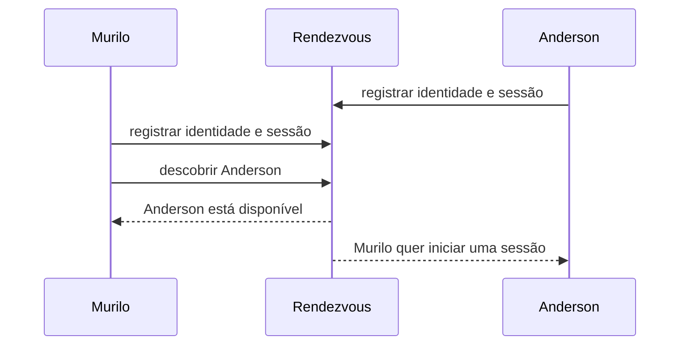
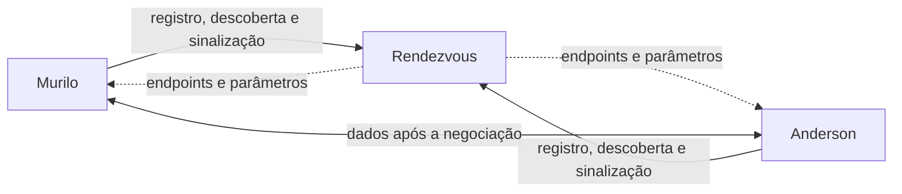

# Como dois peers se apresentam

Murilo e Anderson já tentaram hole punching trocando endpoints manualmente. Depois de [descobrir o endpoint externo com STUN](2026-08-18-como-descobrir-seu-endpoint-externo-com-stun.md), eles deixaram de presumir que a porta externa seria igual à interna. O que continua manual é a apresentação: ainda precisam encontrar um ao outro e trocar a informação de sessão antes de tentar uma conexão direta.

Pedir que os dois descubram um ao outro por acaso não é uma estratégia. Eles precisam compartilhar algum ponto de encontro conhecido. Em arquiteturas P2P, esse papel costuma ser chamado de **rendezvous**.

Rendezvous não é um protocolo único. É uma responsabilidade arquitetural: permitir que peers que ainda não mantêm contato se apresentem e troquem as informações necessárias para tentar uma conexão. A aplicação pode cumprir esse papel com HTTP, WebSocket, SIP, uma Distributed Hash Table (DHT) ou um protocolo próprio.

## Primeiro, o registro

Anderson abre a aplicação e estabelece uma conexão de saída com o servidor de rendezvous. Como a conexão parte de dentro da rede dele, o roteador e o firewall normalmente permitem esse tráfego. A aplicação então registra algo parecido com:

```text
identidade: anderson@example
sessão: dispositivo-7f2a
estado: disponível
canal de sinalização: conexão WebSocket atual
```

Esse registro não precisa publicar um endereço de rede permanente. Ele associa uma identidade conhecida pela aplicação a uma sessão que está alcançável por meio do próprio servidor.

Murilo faz o mesmo. Quando procura Anderson, o servidor consulta os registros ativos e encontra a sessão dele. Isso é **descoberta**: transformar uma referência como nome de usuário, chave pública, código de convite ou identificador de sala em um ou mais peers disponíveis.



Registro e descoberta são relacionados, mas não idênticos. O registro informa "estou aqui". A descoberta responde "quem pode ser encontrado e como iniciar contato".

## Identidade não é endereço

Um endereço IP identifica um ponto da rede naquele momento. Não prova que a pessoa do outro lado é Anderson. O endereço pode mudar quando ele troca do Wi-Fi para a rede celular, reinicia o roteador ou abre a aplicação em outro dispositivo.

A identidade da aplicação precisa sobreviver a essas mudanças. Ela pode ser uma conta autenticada pelo serviço, uma chave pública, um certificado ou outra credencial verificável. O desenho depende do modelo de confiança, mas a separação é importante:

- identidade responde quem é o peer;
- sessão responde qual instância está online agora;
- endereço responde por onde uma tentativa de conexão pode passar.

O servidor de rendezvous pode autenticar Murilo e Anderson antes de apresentá-los. Isso reduz o risco de entregar a sessão ao peer errado, mas não torna automaticamente segura a futura conexão P2P. Os peers ainda precisam autenticar um ao outro e proteger os dados no protocolo da aplicação.

## Sinalização combina a tentativa

Depois da descoberta, o rendezvous transporta mensagens de **sinalização**. Elas não são a conversa final. Servem para combinar como a conversa será tentada.

Murilo e Anderson podem trocar versões de protocolo, capacidades, credenciais temporárias, endpoints identificados com STUN e parâmetros de sessão. Esses endereços também são chamados de candidates em mecanismos como ICE. Por enquanto, basta saber que cada peer pode ter mais de uma possibilidade: um endereço local, outro identificado do lado de fora da rede ou um endereço de relay.

O servidor de rendezvous encaminha essas mensagens pelo canal de sinalização porque o caminho direto de dados ainda não existe. Ele não precisa entendê-las por completo. Um servidor WebSocket, por exemplo, pode apenas entregar uma mensagem de Murilo à sessão autenticada de Anderson.



ICE pressupõe a existência desse mecanismo, mas não define qual protocolo de sinalização a aplicação deve usar. Essa liberdade evita misturar a negociação específica da aplicação com o método usado para entregar as mensagens iniciais.

## Plano de controle e caminho de dados

Rendezvous fica no **plano de controle**. Ele registra participantes, descobre sessões e coordena tentativas. O **caminho de dados** carrega mensagens, áudio, vídeo ou arquivos depois que os peers encontram uma rota utilizável.

Separar os dois planos evita uma confusão comum: usar um servidor para apresentação não significa que todo o sistema deixou de ser P2P. Murilo e Anderson podem depender do rendezvous para se encontrar e, ainda assim, trocar os dados diretamente depois.

A dependência continua relevante. Se o único servidor de rendezvous ficar indisponível, novos peers talvez não consigam se descobrir, embora conexões já estabelecidas possam continuar. O operador também pode observar quem procurou quem, quando as sessões ocorreram e quais informações de conexão foram trocadas. Descentralizar o caminho de dados não elimina esses metadados do plano de controle.

## A apresentação termina onde o teste começa

Ao final da sinalização, Murilo sabe que está falando com uma sessão atribuída a Anderson e recebeu os endpoints que ele reuniu. Anderson recebeu o equivalente sobre Murilo. Ainda não existe garantia de que qualquer uma dessas possibilidades funcione.

STUN já forneceu uma possibilidade externa para cada peer. ICE pode organizar e testar os caminhos trocados; TURN pode oferecer um relay quando a conexão direta falha. Essas ferramentas usam a sinalização para trocar informações, mas não substituem identidade, descoberta ou consentimento.

O rendezvous resolve uma pergunta específica: como dois peers que ainda não se conhecem combinam uma tentativa? Depois disso, Murilo e Anderson podem executar automaticamente o mesmo hole punching que antes dependia de copiar endpoints à mão.

## Referências

- [RFC 8445: Interactive Connectivity Establishment (ICE)](https://www.rfc-editor.org/rfc/rfc8445)
- [RFC 8489: Session Traversal Utilities for NAT (STUN)](https://www.rfc-editor.org/rfc/rfc8489)
- [RFC 8656: Traversal Using Relays around NAT (TURN)](https://www.rfc-editor.org/rfc/rfc8656)