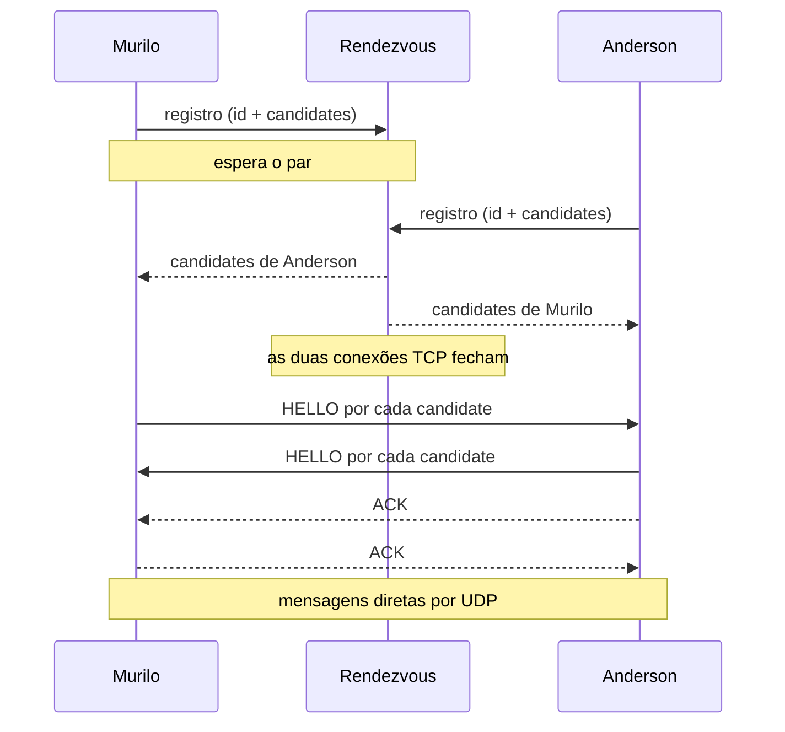

# Conectando dois peers sem copiar endpoints

No experimento de [UDP hole punching](2026-08-18-como-funciona-udp-hole-punching.md), Murilo e Anderson já atravessavam alguns NATs. Depois, [STUN](2026-08-18-como-descobrir-seu-endpoint-externo-com-stun.md) tirou a adivinhação sobre qual porta externa o NAT tinha escolhido. Sobrou uma etapa que nenhum dos dois resolveu: cada pessoa lia um endpoint no próprio terminal, mandava por outro canal e colava o que recebia.

[Como dois peers se apresentam](2026-08-19-como-dois-peers-se-apresentam.md) descreveu o papel que elimina essa cópia. Falta executá-lo.

O programa deste artigo tem duas partes: um rendezvous de 100 linhas e um peer de 169. Sem biblioteca de P2P, sem framework, sem camada de abstração. Quis manter o tamanho em que ainda dá para ler as duas de ponta a ponta e discordar do que está lá.

## Um socket, do começo ao fim

O detalhe mais importante é o mesmo que apareceu no artigo de STUN: a consulta e os dados precisam sair da mesma porta.

Se o programa abrisse um socket para perguntar ao servidor STUN e outro para falar com Anderson, o endereço descoberto descreveria o primeiro mapeamento no NAT. O segundo socket poderia receber outra porta externa. Murilo anunciaria uma informação correta sobre uma porta que não participa da conversa.

Por isso o peer começa assim, e nessa ordem:

```rust
// Um socket, do começo ao fim: o mesmo que consulta STUN e conversa.
let socket = StdUdpSocket::bind("0.0.0.0:0")?;
let candidates = gather_candidates(&socket)?;

socket.set_nonblocking(true)?;
let socket = UdpSocket::from_std(socket)?;
```

`gather_candidates` monta uma lista curta de endereços por onde o outro lado pode tentar chegar: `127.0.0.1`, o IP da interface que o sistema usa para sair para a internet, e o endereço que STUN devolveu. Depois disso o mesmo descritor passa para o socket assíncrono do Tokio.

Chamo esses três de candidates porque são caminhos candidatos, não porque o programa implemente ICE. Ele não atribui prioridade, não forma pares nem faz checks autenticados.

O endereço local está na lista por um motivo prático. Usar só o endereço público obrigaria o roteador a receber um pacote interno destinado ao próprio IP público e devolvê-lo para dentro da rede — o chamado NAT hairpinning, que nem todo equipamento faz. Anunciando também o endereço local, dois processos na mesma máquina ou na mesma LAN não dependem dessa volta.

## A sala só apresenta

O rendezvous tem uma responsabilidade e nenhuma a mais. Cada peer abre uma conexão TCP, manda uma linha JSON e recebe a linha do outro:

```json
{"room":"demonstracao","peer_id":"murilo","candidates":["127.0.0.1:59711","192.168.1.20:59711","198.51.100.12:59711"]}
```

O estado do servidor inteiro cabe em um tipo:

```rust
/// Cada sala guarda no máximo um peer esperando: o registro dele e o canal
/// por onde o segundo a chegar será entregue.
type Rooms = Arc<Mutex<HashMap<String, (Registration, oneshot::Sender<Registration>)>>>;
```

Quem chega primeiro deixa um canal na sala e espera. Quem chega depois encontra esse canal, entrega o próprio registro por ele e leva embora o registro do primeiro. Feita a apresentação, as duas conexões TCP fecham.

Não existe tabela de presença, heartbeat nem lista de quem está online. A conexão TCP aberta é a presença: enquanto o primeiro peer espera, o servidor também vigia o socket dele, e se ele desistir antes do par chegar, a sala volta a ficar livre.



Nada do que Murilo e Anderson digitam passa pelo rendezvous. Ele viu dois registros e saiu do caminho de dados.

## Os dois falam primeiro

Depois que o rendezvous entrega os candidates do outro lado, o peer entra em um único laço. Um `tokio::select!` cuida das três coisas que podem acontecer: o timer de tentativa, um datagrama chegando, uma linha digitada.

```rust
// Os dois lados enviam primeiro: é isso que abre os NATs.
_ = punch.tick(), if endpoint.is_none() => {
    for candidate in &other.candidates {
      socket.send_to(b"HELLO", candidate).await?;
    }
}
```

A cada 350 milissegundos, enquanto não houver caminho, o peer manda `HELLO` para todos os candidates do outro. Os dois fazem isso ao mesmo tempo. É esse o hole punching: os pacotes de saída criam estado nos dois NATs antes que o pacote do outro lado chegue, e o filtro de entrada passa a aceitar o que vier daquela origem.

Os pacotes são texto puro. `HELLO`, `ACK`, `BYE`, e qualquer outra coisa é mensagem:

```rust
match &buffer[..size] {
    b"HELLO" => {
        socket.send_to(b"ACK", from).await?;
        connect(&mut endpoint, from, &other.peer_id);
    }
    b"ACK" => connect(&mut endpoint, from, &other.peer_id),
    b"BYE" if endpoint == Some(from) => { /* ... */ }
    message if endpoint == Some(from) => { /* ... */ }
    _ => {}
}
```

Não há cabeçalho, versão nem campo de tamanho: UDP já preserva a fronteira do datagrama, e o tipo da mensagem é a própria mensagem. Um protocolo de verdade precisaria de mais que isso. Este não precisa, e cada campo a mais aqui seria um parágrafo explicando plumbing em vez de NAT.

O estado da conexão também é pequeno: um `Option<SocketAddr>`. A origem do primeiro `HELLO` ou `ACK` válido vira o endpoint da sessão e não muda depois. Se outro candidate responder atrasado, é ignorado. Se nenhum responder em dez segundos, o peer diz que não há caminho direto e encerra.

## Rodando

O código completo está em [`code/2026-08-19-conectando-dois-peers-sem-copiar-endpoints/`](../../../code/2026-08-19-conectando-dois-peers-sem-copiar-endpoints/).

Três terminais. Primeiro o rendezvous:

```console
$ cargo run --release --bin rendezvous
rendezvous escutando em 0.0.0.0:7777
```

Depois cada peer, com o mesmo nome de sala:

```console
$ cargo run --release --bin peer -- murilo demonstracao 127.0.0.1:7777
```

```console
$ cargo run --release --bin peer -- anderson demonstracao 127.0.0.1:7777
```

O terminal de Murilo, em uma execução real:

```text
candidates locais:
  127.0.0.1:59711
  192.168.1.20:59711
  198.51.100.12:59711
candidates de anderson:
  127.0.0.1:49922
  192.168.1.20:49922
  198.51.100.12:49922
tentando abrir um caminho; /quit encerra
conectado a anderson por 127.0.0.1:49922
[anderson] boa noite murilo
anderson desconectou
```

Com as duas pontas na mesma máquina, o loopback ganhou a corrida — era o esperado, e é também o caso menos interessante. Ninguém copiou um endpoint, que era o ponto.

Para atravessar NAT de verdade, o rendezvous precisa estar em um host alcançável pelas duas redes e o endereço dele vai no terceiro argumento. O resultado deixa de ser garantido: mapping dependente do destino, filtros restritivos, CGNAT e firewalls corporativos derrubam todos os caminhos diretos que essa lista curta consegue oferecer.

## O que ainda falta

Quando as tentativas se esgotam, este programa desiste. TURN mudaria o desfecho com um endereço de relay, ao custo de operação, autenticação, banda e um servidor no caminho de dados. ICE substituiria a lista curta e o "primeiro que responder ganha" por prioridades, pares de candidates e checks autenticados. Nenhum dos dois está aqui.

Também não há entrega garantida, ordenação nem retransmissão — cada mensagem é um datagrama UDP e some sem aviso.

O modelo de ameaça é o de um teste entre duas pessoas: sala combinada fora do sistema, rede de laboratório. Não há criptografia nem autenticação. Quem descobrir o nome da sala se registra nela com o id que quiser, e quem estiver no caminho lê, altera ou repete os datagramas.

O que este incremento entrega é menor e específico: dois processos que se encontram por um identificador combinado, trocam candidates e abrem um caminho sozinhos. Com essa coordenação funcionando, as falhas entre redes reais deixam de ser um exercício manual e passam a ser algo que dá para observar — que é o que ICE precisa medir para escolher melhor que "o primeiro que responder".

## Referências

- [RFC 8445: Interactive Connectivity Establishment (ICE)](https://www.rfc-editor.org/rfc/rfc8445)
- [RFC 8489: Session Traversal Utilities for NAT (STUN)](https://www.rfc-editor.org/rfc/rfc8489)
- [RFC 8656: Traversal Using Relays around NAT (TURN)](https://www.rfc-editor.org/rfc/rfc8656)
