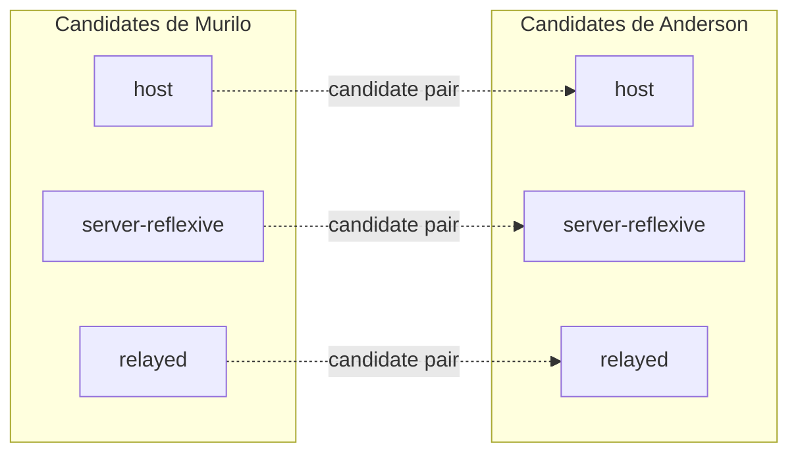
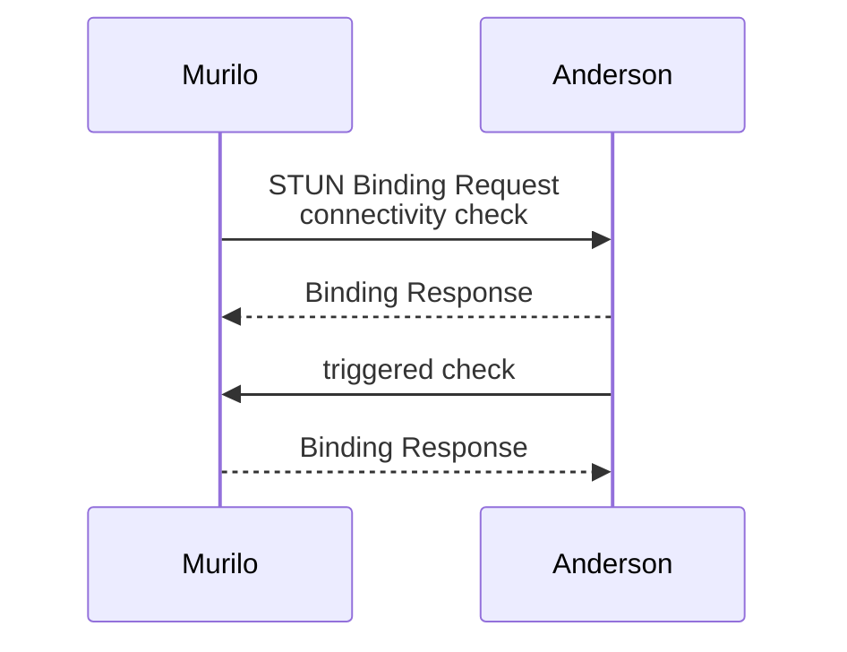

# ICE: testar caminhos em vez de adivinhar o NAT

No artigo de [UDP hole punching](2026-08-18-como-funciona-udp-hole-punching.md), o primeiro candidate que respondesse era escolhido. Isso bastava para demonstrar a ideia, mas não para justificar que aquele era o melhor caminho. Mesmo depois de [descobrir o endpoint externo com STUN](2026-08-18-como-descobrir-seu-endpoint-externo-com-stun.md), saber que Murilo aparece para um servidor como `198.51.100.7:62000` não prova que Anderson consegue alcançá-lo nesse endpoint. O NAT pode criar outra tradução para Anderson, o filtering pode bloquear a entrada ou os dois podem estar na mesma rede e nem precisar do endereço público.

ICE, **Interactive Connectivity Establishment**, troca previsão por experimento: reúne caminhos possíveis, testa cada combinação útil e escolhe um par que realmente transporta pacotes entre os peers. A especificação atual desse processo está na [RFC 8445](https://www.rfc-editor.org/rfc/rfc8445).

Os testes de behavior discovery podem ajudar no diagnóstico ou na ordem das tentativas, mas ICE não depende de classificar previamente o NAT. Ele usa a sinalização estabelecida no rendezvous para trocar possibilidades e depois verifica a conectividade com o peer real.

## Antes do ICE, existe sinalização

Murilo e Anderson usam o canal de sinalização criado pelo rendezvous. Pode ser WebSocket, SIP, HTTP ou outro mecanismo da aplicação. Por ele, trocam candidates, um `username fragment`, uma senha de curta duração e outros parâmetros do ICE. Essas credenciais serão usadas para validar os checks STUN entre os próprios peers; não são uma identidade permanente da pessoa.

ICE não define esse canal. Ele pressupõe que a sinalização consiga entregar as informações com integridade ao peer correto. Se um atacante substituir candidates ou credenciais, os testes podem validar o destino errado.

## Quatro origens de candidates

Um **candidate** representa um endereço e uma porta pelos quais o peer talvez seja alcançável. Cada interface e mecanismo pode produzir possibilidades diferentes.

| Tipo | Como aparece |
|---|---|
| Host | Endereço de uma interface local |
| Server-reflexive | Tradução externa observada por STUN |
| Peer-reflexive | Tradução descoberta pelo outro peer durante um check |
| Relayed | Endereço reservado em um servidor TURN |

O candidate host pode funcionar quando os peers compartilham uma rede ou quando existe conectividade pública. O server-reflexive representa uma tradução do NAT. O relayed oferece um caminho indireto, mas exige uma alocação ativa em um servidor TURN. O peer-reflexive não é reunido antecipadamente: aparece durante um connectivity check quando o endereço observado não coincide com um candidate que o agente já conhecia.

Murilo reúne sua lista, Anderson reúne a dele e os dois fazem a troca pela sinalização. Em implementações com **trickle ICE**, novos candidates podem ser enviados assim que aparecem, sem esperar a coleta inteira terminar.

No experimento anterior, incluímos `127.0.0.1` para que dois processos na mesma máquina tivessem um caminho simples para testar. Isso é uma conveniência daquele programa. O gathering definido para ICE não anuncia endereços de loopback como host candidates para o peer remoto.

## De listas para combinações

ICE combina um candidate local com um remoto para formar um **candidate pair**. Três candidates de cada lado não significam automaticamente nove testes: pares redundantes podem ser eliminados, e os demais recebem prioridades. Candidates de famílias de endereço diferentes, por exemplo, não formam um par entre si.

Pares diretos tendem a ter prioridade sobre relay, mas prioridade não é prova. Um endereço local pode parecer ideal e ser inalcançável. Um relayed pode ser menos desejável e ser o único funcional.

Uma **checklist** é a lista ordenada de pares que serão verificados. ICE não dispara tudo ao mesmo tempo: agenda os checks pela prioridade e controla o ritmo. Isso limita tráfego, evita congestionamento durante a abertura da sessão e permite que resultados acionem testes relacionados.

## Connectivity checks usam STUN

Cada connectivity check é uma transação STUN `Binding Request` autenticada com as credenciais de curta duração trocadas pela sinalização. Murilo envia a requisição pela base do candidate local até o candidate remoto de Anderson. Se Anderson validar a mensagem e devolver a `Binding Response`, aquele sentido do par demonstrou conectividade. Isso não prova sozinho que Anderson consegue iniciar o tráfego no sentido contrário.

A chegada de um check pode disparar um **triggered check** de Anderson para Murilo usando o par correspondente. Assim, os dois sentidos são testados. Os pacotes de saída também criam ou atualizam estado em NATs e firewalls, produzindo o efeito necessário para UDP hole punching quando a topologia permite.

Se Anderson recebe a requisição de uma tradução que não constava entre os candidates de Murilo, ele pode aprender um candidate peer-reflexive a partir do endereço de origem identificado. ICE incorpora essa evidência sem precisar classificar previamente o NAT.

## Controlling, controlled e nomination

Os dois peers não devem nomear pares diferentes ao mesmo tempo. ICE atribui papéis: um agente é **controlling** e o outro, **controlled**. Em uma sessão entre duas implementações completas, o agente iniciador normalmente assume o primeiro papel. Um valor de desempate resolve conflitos quando os dois agentes anunciam o mesmo papel.

O controlling agent decide qual par válido será **nominated**. Quando a nomeação é confirmada, esse par vira o **selected pair**, o caminho usado pelos dados da aplicação naquele componente da sessão.

Um par pode passar no teste sem ser selecionado. Essa diferença permite esperar um candidate melhor ou manter alternativas válidas enquanto a escolha é concluída. Se nenhum caminho direto funcionar, um candidate relayed obtido por uma alocação TURN já realizada pode formar um par válido e ser nomeado. TURN exige um servidor separado, credenciais e tráfego de dados pelo relay; não aparece automaticamente depois que ICE falha.

## O caminho precisa continuar vivo

NATs removem traduções sem tráfego. Firewalls também expiram estado. Depois da seleção, a aplicação precisa manter a conectividade ativa quando não existem dados suficientes para isso.

ICE pode enviar `Binding Indications`, mensagens STUN unidirecionais sem autenticação, como keepalive para manter o estado dos NATs ativo. O protocolo que usa ICE também pode exigir verificações de consentimento. O intervalo deve equilibrar estabilidade, consumo de rede e bateria. Keepalive frequente demais desperdiça recursos; raro demais deixa a tradução expirar.

Mudanças de interface, endereço ou rede podem invalidar o selected pair. Nesse caso, os peers podem executar um **ICE restart**, trocar um novo `username fragment`, uma nova senha e candidates atualizados.

## Evidência vence o rótulo

ICE não precisa decidir se o roteador de Murilo é full cone, symmetric ou uma combinação fora dessas categorias. Ele também não assume que uma medição feita com um servidor descreve o caminho até Anderson.

A pergunta é mais concreta: este candidate local consegue trocar mensagens autenticadas com aquele candidate remoto agora? O selected pair é a resposta comprovada. TURN amplia o conjunto de respostas possíveis, mas seus candidates precisam ser alocados e testados como os demais.

## Referências

- [RFC 8445: Interactive Connectivity Establishment (ICE)](https://www.rfc-editor.org/rfc/rfc8445)
- [RFC 8489: Session Traversal Utilities for NAT (STUN)](https://www.rfc-editor.org/rfc/rfc8489)
- [RFC 8656: Traversal Using Relays around NAT (TURN)](https://www.rfc-editor.org/rfc/rfc8656)
