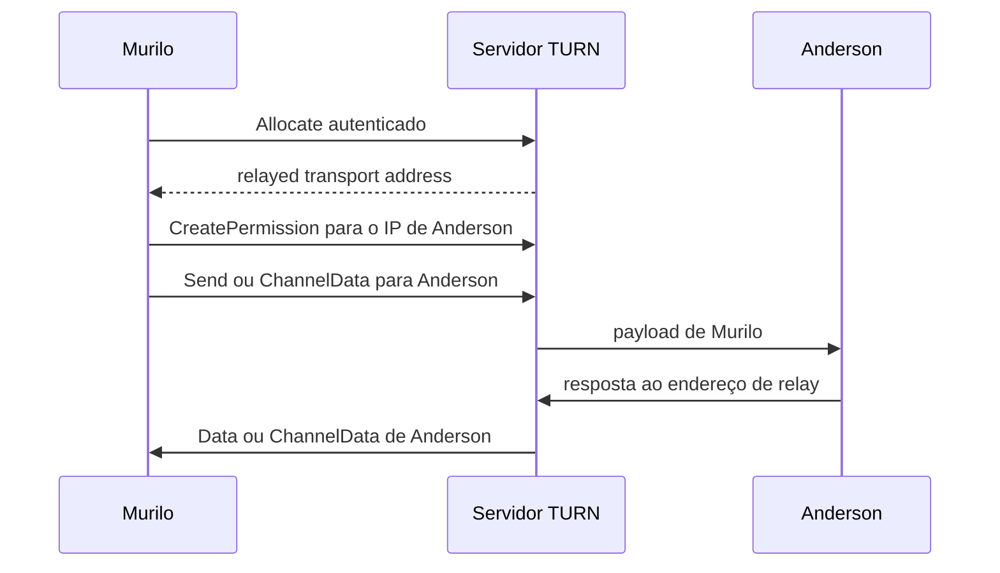

# TURN: quando a conexão direta falha

Murilo e Anderson trocaram candidates e testaram caminhos diretos. Nenhum par passou nos checks. A rede corporativa de Anderson bloqueia UDP entre máquinas externas, e insistir em hole punching não altera essa política.

TURN oferece outra geometria. Em vez de exigir que os peers alcancem um ao outro, cada um mantém comunicação de saída com um servidor público. Esse servidor atua como **relay**: recebe dados de um lado e os retransmite ao outro. TURN é o protocolo que controla esse relay com autenticação, alocações e permissions.

Isso não significa que o relay só seja criado depois de uma falha. Em uma implementação ICE, o peer pode alocar um relay enquanto reúne candidates ou quando percebe que precisa de uma alternativa. O candidate relayed entra na mesma lista dos demais e ainda precisa formar um par que passe nos checks.

TURN significa **Traversal Using Relays around NAT**. Sua especificação atual é a [RFC 8656](https://www.rfc-editor.org/rfc/rfc8656), que substituiu a RFC 5766.

## Allocate cria um endereço no relay

Murilo começa com uma requisição `Allocate`. Criar um relay consome portas, memória e banda, então a operação exige autenticação. O fluxo comum usa credenciais de longo prazo: o servidor desafia o cliente, que repete a requisição com os dados necessários para provar sua autorização.

Quando aceita a alocação, o servidor reserva um **relayed transport address**. Esse endereço pertence ao relay durante a vida da alocação.

```text
socket local de Murilo:     192.168.1.10:50000
origem vista pelo TURN:     198.51.100.7:62000
relayed transport address:  192.0.2.50:55000
```

O segundo valor é a tradução feita pelo NAT de Murilo. O terceiro é diferente: uma porta controlada pelo servidor TURN. Anderson envia para `192.0.2.50:55000`, e o relay encaminha os dados pela conexão mantida com Murilo.

Esse endereço também pode ser apresentado ao ICE como um **relayed candidate**. ICE testa candidates diretos e de relay e usa TURN como fallback quando os pares preferidos falham.

## Permissions limitam quem pode enviar

Uma alocação não deve virar uma porta pública aberta para qualquer origem. Murilo cria uma **permission** para o endereço IP de Anderson. Essa permission autoriza o relay a aceitar, em direção à alocação de Murilo, tráfego vindo daquele IP.

Permissions têm validade limitada e não escolhem uma única porta remota. Elas autorizam um IP, enquanto um channel binding pode associar esse peer a um endereço e porta específicos. Pacotes de origens sem permission são descartados.

Autenticação da alocação e permissions protegem o uso do relay, mas não confirmam a identidade de Anderson no protocolo da aplicação. Murilo ainda precisa autenticar o peer e validar o conteúdo recebido.

## Duas formas de carregar dados

No sentido cliente para peer, Murilo pode usar uma **Send Indication**. Ela contém o endereço de Anderson e os bytes a retransmitir. O servidor remove o envelope TURN e envia os bytes para o destino.

Quando os dados voltam, o servidor pode entregar uma **Data Indication** a Murilo, informando de qual peer vieram. Send e Data são simples, mas repetem atributos e cabeçalhos a cada mensagem.

Para tráfego frequente, Murilo pode associar um número curto ao endereço de Anderson por meio de um **channel binding**. Depois disso, mensagens **ChannelData** carregam o número do canal e o payload com menos overhead. Conceitualmente, a diferença é esta:

- Send/Data identifica o peer em mensagens STUN;
- ChannelData usa uma associação já criada para reduzir o cabeçalho.

Nos dois casos, o relay continua encaminhando datagramas. TURN não interpreta áudio, mensagens ou blocos de arquivo da aplicação.

## O fluxo de Murilo e Anderson



  Murilo não recebe um túnel mágico até Anderson. Ele obtém estado temporário no servidor: uma alocação, permissions e, opcionalmente, canais. Cada elemento tem regras e tempo de vida próprios.

## Refresh mantém o estado

A alocação expira. Murilo usa `Refresh` para estender sua duração enquanto a sessão continua. Permissions e channel bindings têm estados separados e também precisam ser renovados conforme suas próprias validades.

Esses ciclos permitem ao servidor recuperar recursos abandonados quando um cliente fecha sem aviso. Também significam que uma interrupção prolongada pode apagar o estado. O cliente precisa detectar falhas, realocar quando necessário e informar ao mecanismo de seleção de caminhos que o candidate anterior deixou de existir.

Um `Refresh` com tempo de vida zero solicita a remoção da alocação. Encerrar explicitamente libera recursos mais cedo, embora o servidor ainda dependa da expiração para clientes que desapareceram.

## Confiabilidade tem custo

No caminho direto, a infraestrutura de rendezvous coordena a sessão, mas não carrega cada pacote. Com TURN, todo byte retransmitido cruza o servidor. Um megabyte enviado por Murilo entra no relay e sai novamente em direção a Anderson. Para o operador, isso representa banda nas duas pernas.

O desvio também pode aumentar latência, especialmente se o servidor estiver longe dos peers. Capacidade insuficiente produz filas e perda. Operar TURN exige planejar distribuição geográfica, portas públicas, limites por usuário, monitoramento e proteção contra abuso.

O relay observa metadados: IP do cliente, IPs permitidos, horários, duração e volume de tráfego. Proteger a conexão entre cliente e TURN com TLS ou DTLS limita observadores naquele trecho, mas o servidor ainda processa o encaminhamento.

Criptografia fim a fim deve proteger o conteúdo entre Murilo e Anderson antes de ele entrar no TURN. Assim, o relay encaminha ciphertext, embora continue vendo os metadados necessários à operação. TURN não substitui autenticação dos peers nem criptografia da aplicação.

## Fallback, não fracasso

Uma conexão retransmitida não é tão direta quanto o caminho P2P desejado, mas é um resultado útil. Redes móveis, hotéis, empresas e provedores aplicam políticas que nenhum algoritmo do cliente consegue remover.

ICE inclui o relayed candidate entre as possibilidades, prefere caminhos diretos quando funcionam e seleciona TURN quando eles falham. Essa ordem trata relay como fallback por causa do custo, não como uma solução inferior. Quando a rede não permite contato direto, TURN troca a eficiência ideal por conectividade previsível.

## Referências

- [RFC 8445: Interactive Connectivity Establishment (ICE)](https://www.rfc-editor.org/rfc/rfc8445)
- [RFC 8489: Session Traversal Utilities for NAT (STUN)](https://www.rfc-editor.org/rfc/rfc8489)
- [RFC 8656: Traversal Using Relays around NAT (TURN)](https://www.rfc-editor.org/rfc/rfc8656)